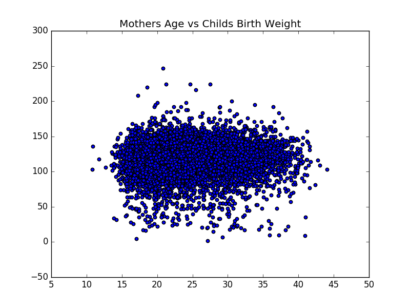

[Think Stats Chapter 7 Exercise 1](http://greenteapress.com/thinkstats2/html/thinkstats2008.html#toc70) (weight vs. age)

>> Exercise 7.1 Using data from the NSFG, make a scatter plot of birth weight versus mother’s age. Plot percentiles of birth weight versus mother’s age. Compute Pearson’s and Spearman’s correlations. How would you charac- terize the relationship between these variables?

```
import nsfg
preg = nsfg.ReadFemPreg()
live = preg[preg.outcome == 1]

birth_weightLB = live.birthwgt_lb
birth_weightOZ = live.birthwgt_oz
def lb2oz(lb):
	return lb/0.0625

birth_weight = birth_weightLB.map(lb2oz) + birth_weightOZ
mother_age = live.agepreg 

plt.scatter(mother_age, birth_weight) # nothing
plt.title('Mothers Age vs Childs Birth Weight')
```


```
# Pearson
mother_age.corr(birth_weight) # 0.068833970354109111
# Spearman
mother_age.corr(birth_weight, method = 'spearman') # 0.094610041096582262
```
