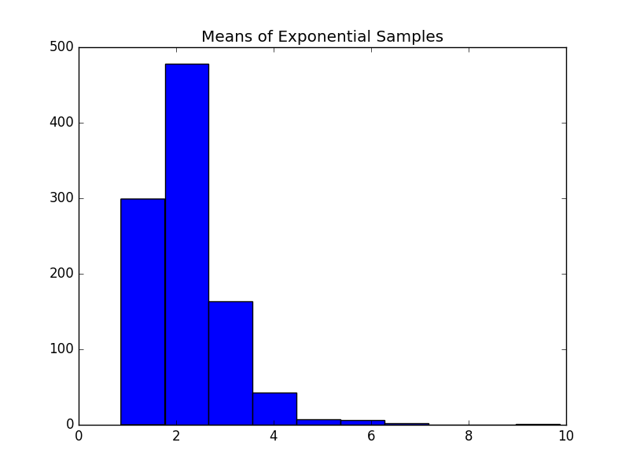

[Think Stats Chapter 8 Exercise 2](http://greenteapress.com/thinkstats2/html/thinkstats2009.html#toc77) (scoring)


>>> Simulate 1000 10-samplings from an exp distribution where lambda = 2. Plot the resulting L estimates...  (1/sample_mean) Compute the Standard Error and the 90% Confidence interval...

```
def ExpSamp(n = 10, m = 1000, lam = 2):
	means = []
	medians = []

	for _ in range(m):
		xs = np.random.exponential(1./lam, n)
		L = 1./xs.mean()
		Lm = np.log(2)/np.median(xs)
		means.append(L)
		medians.append(Lm)

	return np.array(means), np.array(medians)


means, medians = ExpSamp()
plt.hist(means)
```



```
u = 1/2.

# this is the Standard Error?
rmse_means = np.sqrt(((means - u)**2).sum()/len(means)) # 1.87
rmse_meds = np.sqrt(((medians - u)**2).sum()/len(medians)) # 2.13

# 90% confidence interval is 95th%ile -5th%ile... for some reason
fifth_ptile = np.percentile(means, 5) # 1.264
nty5_ptile = np.percentile(means, 95) # 3.687
nty5_ptile - fifth_ptile # 2.424


# Try with different sample sizes (n)
std_errs = []
c_intervals = []
for n in range(5,25):
	means, medians = ExpSamp(n = n)
	std_err = np.sqrt(((means - u)**2).sum()/len(means))
	fifth_ptile = np.percentile(means, 5)
	nty5_ptile = np.percentile(means, 95)
	std_errs.append(std_err)
	c_intervals.append((fifth_ptile, nty5_ptile))

plt.plot(std_errs) # decreasing as sample size increases
c_ranges = map(lambda c: c[1]-c[0], c_intervals)
plt.plot(c_ranges) # decreasing ranges as sample size increases... what does this mean?

